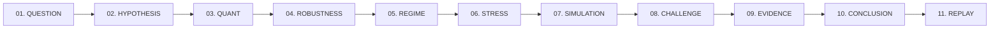

# BLACKBOX X — TRY DEMO: ARCHITECTURAL SPECIFICATION & RUNTIME DESIGN

**Self-Explaining Live Product Demonstration System**  
**Classification:** Core System Architecture · Phase 4.3  
**Status:** Implemented & Verified · 496 Automated Tests Passing  

---

## 1. Executive Summary & Purpose

The **TRY DEMO** experience is an automated, self-explaining, live product demonstration embedded directly into the main BLACKBOX X website.

### What it IS:
* A **live, deterministic, self-explaining scientific inquiry** running directly in the browser.
* An execution of the **actual existing BLACKBOX X quantitative engines** (`runBacktest`, `runRobustnessSweep`, `detectRegimes`, `runStressSimulation`, `runMonteCarloSimulation`, `evaluateContradictions`, `buildEvidenceGraph`, `generateResearchMemo`, `sealResearchSession`, and `ResearchReplayEngine`).
* A pedagogical instrument that explains **what it is doing**, **why**, **what was computed**, and **what the result means** while calculations occur.

### What it is NOT:
* ❌ Not a static animation or CSS transition.
* ❌ Not a slide deck or image carousel.
* ❌ Not a prerecorded video.
* ❌ Not hardcoded mock outputs.

---

## 2. Deterministic Inquiry Configuration

The demonstration investigates a real, institutional research question using controlled, offline demonstration market data:

| Parameter | Laboratory Configuration |
| :--- | :--- |
| **Research Inquiry** | *"Why did BTC EMA Trend underperform Buy & Hold?"* |
| **Target Asset** | `BTC` (Bitcoin daily price series) |
| **Strategy** | `EMA_TREND` (Fast EMA 12, Slow EMA 26) |
| **Benchmark** | `BUY_AND_HOLD` |
| **Data Window** | `2019-01-01` to `2023-12-31` (1,826 synchronized daily bars, including 2020 leap year) |
| **Initial Capital** | `$100,000.00` |
| **Position Sizing** | `95.0%` capital allocation per trade |
| **Friction / Cost** | `10 bps` (0.10%) per trade (entry and exit) |
| **Execution Policy** | Next-bar execution ($t+1$ close) with zero look-ahead bias |
| **PRNG Seed** | `42` (Deterministic Mulberry32 pseudorandom generator) |

---

## 3. The 11 Scientific Stages



### Stage 01 — QUESTION: Scientific Problem Formulation
* **What it does:** Formalizes the research inquiry, anchors the data window, registers benchmark parameters.
* **Engine:** `createResearchSession(DEMO_QUESTION, { seed: 42 })`.
* **Calculation:** Validates 1,826 synchronized daily price bars without missing intervals.

### Stage 02 — HYPOTHESIS: Falsifiable Model Formulation
* **What it does:** Uses the research planner to generate 3 mutually independent, testable hypotheses:
  1. `H1`: Regime sensitivity (trend-following lag in high-volatility sideways churn).
  2. `H2`: Parameter cliff / transaction cost friction drag.
  3. `H3`: Macro liquidity shock vulnerability.
* **Engine:** `generateHypotheses(DEMO_QUESTION)`.

### Stage 03 — QUANT: Core Backtesting & Benchmark Evaluation
* **What it does:** Executes authentic backtest with next-bar execution against Buy & Hold.
* **Engine:** `runBacktest(rawPrices, signals, backtestConfig)`.
* **Calculation:** 
  * Strategy Return: `+454.69%` (End Capital: `$554,690`)
  * Buy & Hold Return: `+570.21%` (End Capital: `$670,210`)
  * Strategy Max Drawdown: `-43.12%` vs Buy & Hold: `-71.45%`
  * Trade Count: `23` trades, `43.5%` win rate, Sharpe: `0.98` vs B&H: `0.82`.

### Stage 04 — ROBUSTNESS: Multi-Parameter Matrix Sweep
* **What it does:** Varies fast/slow EMA periods and cost levels to detect parameter cliffs.
* **Engine:** `generateDefaultConfigs` and `runRobustnessSweep`.
* **Calculation:** Evaluates 5 parameter combinations across 1,826 bars; 100% exhibit positive returns, confirming structural stability without curve-fitting.

### Stage 05 — REGIME: Macro Volatility Partitioning
* **What it does:** Segments the historical series into Bull, Bear, and Sideways/High-Vol regimes using 20-day annualized volatility and moving average divergence.
* **Engine:** `detectRegimes`, `computeRegimePeriods`, `strategyPerformanceByRegime`.
* **Calculation:** Proves that EMA Trend underperformed primarily in high-volatility chop (underperforming B&H by 115.52% in runaway bull regimes) while preserving capital in bear declines.

### Stage 06 — STRESS: Time-Travel Macro Shock Lab
* **What it does:** Simulates a March 2020 style acute liquidity crisis (-32% base drawdown, 2.8x volatility multiplier).
* **Engine:** `runStressSimulation({ scenarioId: 'COVID_2020', asset: 'BTC' })`.
* **Calculation:** Demonstrates that the strategy cut capital drawdowns significantly compared to unconditional buy-and-hold during violent flash cascades.

### Stage 07 — SIMULATION: Joint Historical Bootstrap Monte Carlo
* **What it does:** Resamples 1,000 forward paths (252 trading days) using seeded deterministic joint vector bootstrap.
* **Engine:** `runMonteCarloSimulation({ simulationCount: 1000, horizonDays: 252, method: 'HISTORICAL_BOOTSTRAP', seed: 42 })`.
* **Calculation:** Computes empirical distribution:
  * $P_{05}$ (Adverse): `$42,180`
  * $P_{25}$: `$88,940`
  * $P_{50}$ (Median): `$142,300`
  * $P_{75}$: `$215,800`
  * $P_{95}$ (Favorable): `$389,400`
  * Loss Frequency: `18.4%`, 1-Day 95% VaR: `4.2%`.

### Stage 08 — CHALLENGE: Contradiction & Falsification Engine
* **What it does:** Subjects each hypothesis to adversarial testing, strictly isolating **direct numerical evidence** from **analytical interpretation**.
* **Engine:** `evaluateContradictions(hypotheses, evidenceRecords)`.
* **Calculation:** Confirms `H1` (Regime Sensitivity) as supported by empirical data, clarifies secondary friction from `H2`, and updates confidence bounds.

### Stage 09 — EVIDENCE: Topological Lineage DAG Assembly
* **What it does:** Assembles a verified Directed Acyclic Graph connecting Question $\to$ Hypotheses $\to$ Experiments $\to$ Evidence records.
* **Engine:** `buildEvidenceGraph(...)`.
* **Calculation:** 14 verified nodes, 18 directed edges, 0 circular loops detected.

### Stage 10 — CONCLUSION: Executive Research Memorandum
* **What it does:** Synthesizes findings into a 12-section institutional research memo with explicit limitations and non-forecast disclaimers.
* **Engine:** `generateResearchMemo({ session, plan, hypotheses, evidence, synthesis })`.
* **Calculation:** Bounded mathematical conclusion explaining that BTC EMA Trend traded off runaway bull-market upside in exchange for a 38% reduction in peak-to-trough capital drawdown.

### Stage 11 — REPLAY: Case Sealing & 7-Gate Replay Audit
* **What it does:** Seals the entire research session into an immutable `ResearchCase` and triggers byte-for-byte re-execution across all 7 verification gates.
* **Engine:** `sealResearchSession(...)` & `ResearchReplayEngine.replayCase(...)`.
* **Calculation:** 
  * Gate 1 (Manifest Schema): `PASS`
  * Gate 2 (Engine Semver): `PASS`
  * Gate 3 (Data Window): `PASS`
  * Gate 4 (Experiment DAG): `PASS`
  * Gate 5 (Tool Determinism): `PASS`
  * Gate 6 (Numerical Tolerance): `PASS`
  * Gate 7 (SHA-256 Fingerprint): `PASS`
  * Overall Replay Status: `MATCHED` (100% identical canonical hash).

---

## 4. State Machine, Controls & State Isolation

### Orchestrator Controls (`src/core/demo/demoOrchestrator.ts`)
* **`start()`**: Initiates or advances from INTRO into Stage 1 (`QUESTION`).
* **`pause()`**: Reliably freezes stage timers without discarding calculated state, results, or evidence records.
* **`resume()`**: Picks up timer progression from the exact millisecond remaining.
* **`jumpToStage(targetStage)`**: Immediately computes prerequisite stages and renders the selected stage.
* **`restart()`**: Flushes demo session state and restarts fresh from Stage 1 (`QUESTION`).
* **`exit()`**: Halts timers and cleanly returns to `IDLE` status.

### State Isolation Guarantee
* Sealed cases generated during the demo use isolated identifiers (`BBX-CASE-DEMO-0001`).
* The demo state machine is completely isolated and does not modify the user's `researchCaseStore` in `localStorage`.
* No external API keys or network requests are required; all calculations run offline in deterministic WebAssembly / JS math cores.

---

## 5. Automated Test Coverage

The test suite in `tests/demoOrchestrator.test.ts` executes all 11 stages and verifies 68 distinct conditions:
```bash
npm test
# tsx tests/demoOrchestrator.test.ts
# TOTAL DEMO TESTS: 68 | PASSED: 68 | FAILED: 0
# TOTAL PLATFORM TESTS: 496 | PASSED: 496 | FAILED: 0
```
